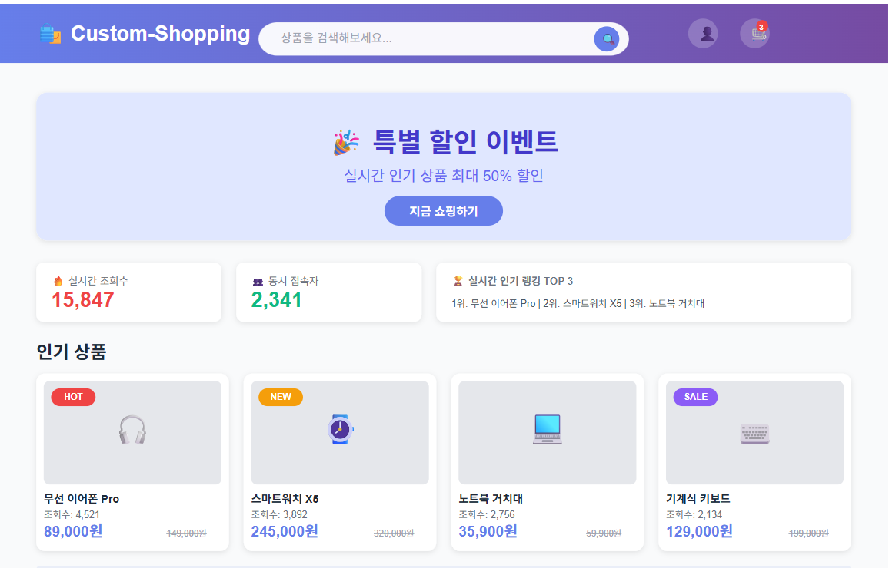
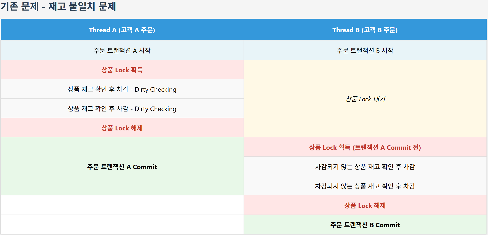
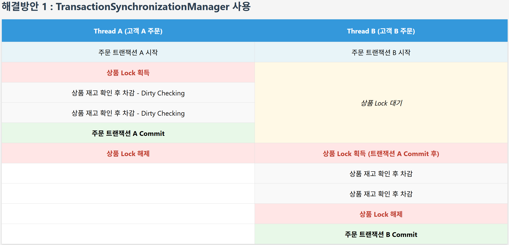
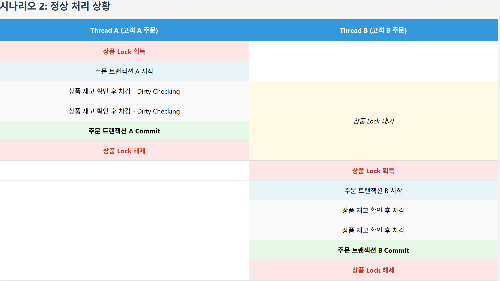
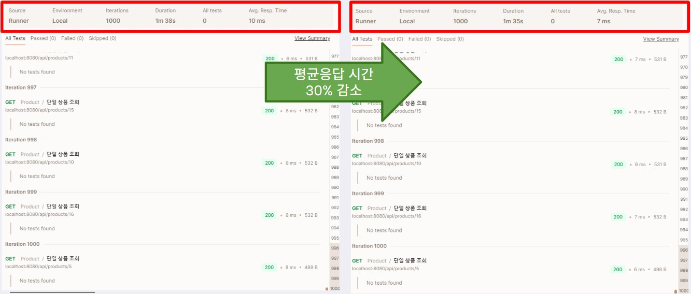

# 🛒Custom-Shopping

---

## 목차

1. 프로젝트 소개
2. 주요기능
3. 트러블 슈팅

---

## 프로젝트 소개

**Custom-Shopping**은 기존 5인 팀 프로젝트를 리팩토링하여
 
**대규모 트래픽 환경**에서 **상품 구매 서비스**와 **실시간 조회수, 랭킹**을 제공하는**온라인 쇼핑몰 서비스**입니다.

---

## 주요기능

### 1️⃣ **상품 주문: Redisson 분산 락 적용**
- 대용량 트래픽 상황에서 동시성 이슈 제어.
- Redisson RLock으로 락 자동 관리, 안정적인 락 구현.
---

### 2️⃣ **상품 조회수, 랭킹 조회**
- 상품을 조회할 때마다 조회수 UPDATE 쿼리를 추가로 날려야 하는 상황을 막기 위해 캐싱 활용.
- 응답시간 성능 향상.
---

### 3️⃣ **상품 조회수, 랭킹 업데이트**
- 각 상품별 UPDATE 쿼리 실행 횟수를 줄이고 네트워크, DB 부하 완화.
- UPDATE 쿼리를 개별 생성하되, 일정 단위 (batch size)로 묶어 한번에 DB로 전송.
---

### 4️⃣ **JWT 인증**
- 상태를 저장하지 않는 JWT의 특성 때문에 로그아웃, 토큰 재발급 관리를 위해 Redis 활용.
- Refresh Token을 저장해 토큰 갱신, 로그아웃 or 탈퇴 시 access token 블랙리스트 처리.

---

## 트러블 슈팅

[주요 트러블 슈팅 내용](https://velog.io/@dkzh506/series/Project)

---

### 락 사용 시 트랜잭션 범위 설정

1. **문제**  
   - 락 적용 후 주문 생성 ,취소 시 재고 불일치 발생
     - 트랜잭션 커밋 후 재고 확인이 가능   
     - 락 해제 시점과 트랜잭션 해제 시점이 맞지 않아 다른 스레드에서 재고 불일치 발생

---

2. **해결 방안 1**  
   - **JPA를 NativeQuery로 변경 시도**  
     - 트랜잭션이 커밋되지 않으면 여전히 다른 트랜잭션에서는 이전 값만 조회함.
     
   - **Redisson 락 해제 시점 조정**
     - 락을 트랜잭션 커밋 후에 해제되도록 TransactionSynchronizationManager를 통해 처리
     - 하나의 스레드가 트랜잭션 커밋한 후 다른 스레드가 락을 획득할 수 있도록 설정.

3. **해결 방안1 문제점 발생**
    - Lock 획득이 트랜잭션 내부에 있으면, Lock의 생명주기가 트랜잭션 경계에 종속되어야 하는데,
    - Lock 해제는 트랜잭션 Commit 후에 이루어져야 하므로 생명주기를 일관되게 관리할 수 없다
        - 이렇게 되면 데드락, 데이터 불일치 등의 문제가 발생할 수 있습니다.

---

4. **해결 방안 2(정상 처리 상황)**
    - Lock 획득 시점을 트랜잭션 전으로 하여 트랜잭션 범위를 확실하게 조정하여 구조적 해결

---

### 동시성 이슈 제어, 성능 개선 : 응답 시간 30% 감소

3. **도입 배경**
    - 트래픽이 몰리고 동시 구매가 많이 발생하는 상품의 구매를 정확히 처리
    - 인기 상품의 조회수와 랭킹을 실시간으로 업데이트 하는 기능 필요

4. **기술적 선택지**

    1. **Redisson 분산 락 적용**
        - 상품 주문이 동시에 이루어질 때 트랜잭션 커밋 시점과 Synchronized 의 시점 차이로 상품 재고 데이터 정합성 깨짐

    2. **Redis 캐싱**
        - 일일 실시간 상품 조회수와 랭킹 제공
        - 조회수 UPDATE 쿼리가 매번 실행되어 과도한 DB 접근 상황 발생
        - 여러 상품의 조회수를 한 번에 업데이트 할 수 있는 쿼리 필요

   **결론:** Redisson 기반 분산락 적용, 조회수 캐싱 및 batch로 UPDATE 쿼리 묶어 DB로 한번에 전송.

---

